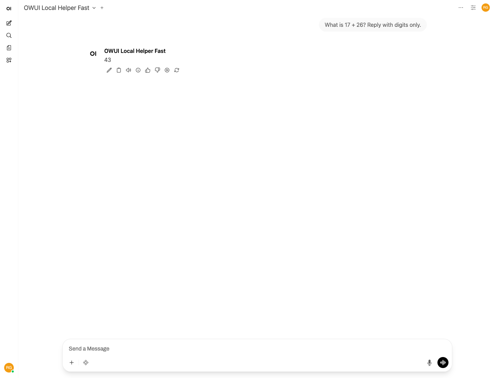
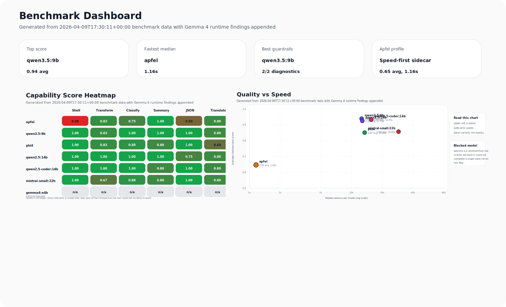
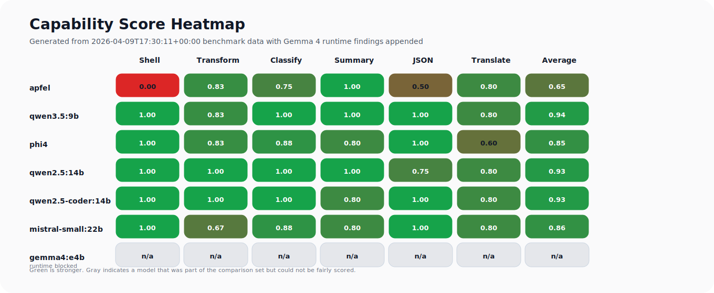
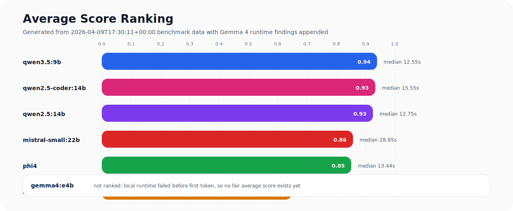
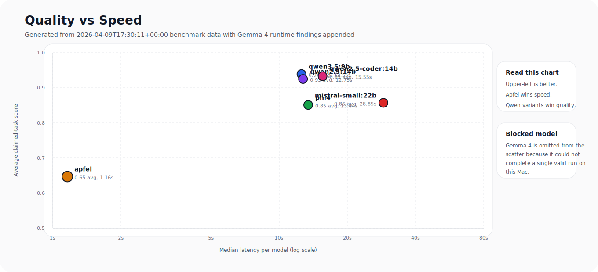
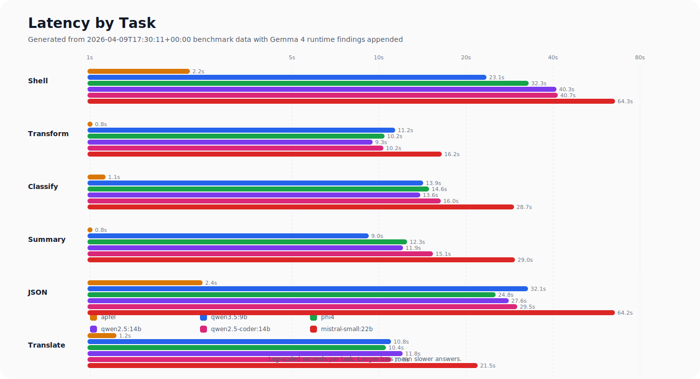
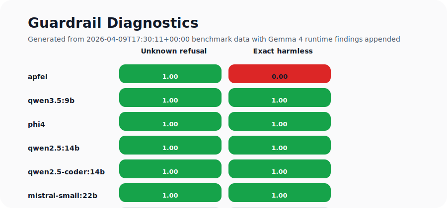
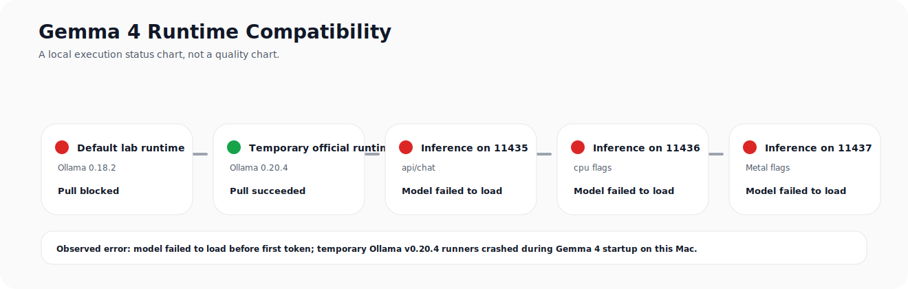

# Local LLM Lab

A proof-backed local AI workstation for Apple Silicon: Ollama, Open WebUI, tuned helper roles, and browser-validated evidence of what actually works.

Live site: [local-llm-lab.vercel.app](https://local-llm-lab.vercel.app)

GitHub repo: [Rajeev-SG/local-llm-lab](https://github.com/Rajeev-SG/local-llm-lab)



## Why this repo exists

Most “local AI setup” repos stop at install instructions. This one is built around a more useful question:

> Which local models are actually worth running on this machine, in this runtime, with this UI, and how do we prove it?

Local LLM Lab answers that with:

- a working Ollama + Open WebUI stack
- role-tuned helper aliases instead of one vague default model
- explicit notes about what passed, what failed, and why
- real browser proof using Playwright, not only shell smoke tests
- a practical agent-offload workflow for coding and research tasks

## What is proven right now

| Area | Current answer |
|------|----------------|
| Best clean general local model | `mistral-small:22b` |
| Best clean coding-focused local model | `qwen2.5-coder:14b` |
| Best fast helper | `qwen3.5:9b` with `think=false` |
| Best conservative helper | `phi4` |
| Largest model proven through Open WebUI | `mistral-small:22b` |
| Browser validation | Real Open WebUI prompt-response path verified with Playwright |

The strongest current proof artifacts are:

- [benchmark-results.md](./benchmark-results.md)
- [model-sweep-20260322.md](./output/acceptance/model-sweep-20260322.md)
- [agent-offload-role-proof-20260322.md](./output/acceptance/agent-offload-role-proof-20260322.md)
- [desktop-final.png](./output/playwright/agent-offload-role-proof-20260322/desktop-final.png)

Latest benchmark takeaway:

- `apfel` is the fastest option in the lab for tiny offline tasks, but it underperforms the stronger Ollama models on shell generation and structured JSON work.
- `gemma4:e4b` is now tracked in the benchmark visuals, but the model is still runtime-blocked on this machine through Ollama, so it is listed as `n/a` rather than scored.
- The current Apfel benchmark and workflow recommendation are captured in [apfel-benchmark-20260409.md](./output/acceptance/apfel-benchmark-20260409.md).

## Benchmark Graphs

The current chart set is generated from the scored benchmark JSON plus the Gemma 4 blocked-run artifact:

- [chart index](./output/charts/benchmark-20260409/README.md)

### Overview dashboard



### Master comparison charts













## Practical hardware takeaway

This lab was tuned on a `48 GB` Apple Silicon machine, but the currently reliable Docker Ollama runtime only exposes about `15.7 GiB` to the model runner. That changes the real model envelope:

- `9B` to `14B` models are the sweet spot
- `mistral-small:22b` is the heaviest model proven cleanly working end-to-end
- `30B+` models are still documented as constrained or failing under the current runtime ceiling

That honesty matters. A useful local AI lab should explain the limits as clearly as the wins.

## Model roles

| Role | Alias | Base model | Best use |
|------|-------|------------|----------|
| Fast helper | `local-helper-fast` | `qwen3.5:9b` | Context compression, clustering, cheap first-pass digestion |
| Safe helper | `local-helper-safe` | `phi4` | Conservative summaries, checklists, lower-loss extraction |
| Code helper | `local-coder-helper` | `qwen2.5-coder:14b` | API surfaces, diffs, code-aware distillation |
| Heavy helper | `local-helper-heavy` | `mistral-small:22b` | Harder local synthesis and stronger general chat |
| Reasoning fallback | `local-reasoner-clean` | `gpt-oss:20b` | Optional heavier reasoning-style fallback |
| Synthesis fallback | `local-thinker-clean` | `qwen2.5:14b` | Broader local synthesis without visible reasoning by default |

## Quick start

### 1. Start the runtime

```bash
./scripts/start-ollama.sh
./scripts/start-openwebui.sh
```

### 2. Create role-tuned helper aliases

```bash
./scripts/setup-agent-offload-models.sh
```

### 3. Create tuned Open WebUI role presets

```bash
OPENWEBUI_PASSWORD='<your-openwebui-password>' ./scripts/setup-openwebui-role-models.sh
```

### 4. Check status

```bash
./scripts/status.sh
```

### 5. Enable private remote access on your own devices

```bash
./scripts/enable-tailscale-openwebui.sh
```

This does not publish Open WebUI to the open internet. It exposes the UI over Tailscale Serve so only devices signed into the same tailnet can reach it. Use this when you want your phone, tablet, or another laptop to reach the lab safely.

## Day-to-day commands

### Core services

```bash
./scripts/start-ollama.sh
./scripts/stop-ollama.sh
./scripts/start-openwebui.sh
./scripts/stop-openwebui.sh
./scripts/enable-tailscale-openwebui.sh
./scripts/disable-tailscale-openwebui.sh
```

### Model setup and testing

```bash
./scripts/setup-agent-offload-models.sh
./scripts/test-models.sh
./scripts/benchmark-model.sh mistral-small:22b
./scripts/generate-benchmark-charts.py
```

### Agent offload workflow

```bash
agent-offload-sync
./scripts/test-agent-offload.sh
agent-offload audit-codex
```

### Raw Ollama

```bash
ollama list
ollama run mistral-small:22b
ollama show qwen2.5-coder:14b
```

## How the architecture works

This repo recommends a two-tier system rather than a full local-agent swap:

1. Retrieve narrowly with tools like `rg`, `probe`, `qmd`, and `context7`.
2. Offload repetitive context digestion to a tuned local helper role.
3. Keep final judgment, edits, and planning in the stronger main coding agent.
4. Validate outcomes with real acceptance proof.

That architecture is documented in [agent-offload-setup-recommendation.md](./agent-offload-setup-recommendation.md).

## Repo layout

| Path | Purpose |
|------|---------|
| `scripts/` | Service control, model setup, tuning, and test scripts |
| `modelfiles/` | Deterministic helper model wrappers |
| `config/agent-offload.toml` | Shared broker configuration |
| `broker/agent_offload.py` | Role-aware offload broker |
| `output/charts/` | Generated benchmark comparison charts |
| `output/acceptance/` | Human-readable proof notes |
| `output/playwright/` | Browser-level acceptance artifacts |
| `site/` | Public landing page for the lab |

## Current recommendation

Use this lab for:

- local AI experimentation that is grounded in real runtime evidence
- role-based helper design for coding agents
- Apple Silicon model selection without guesswork
- Open WebUI setups that need actual browser proof

## Safe remote access

If you want access away from the Mac without broadly exposing your laptop to the public internet, the recommended path is Tailscale Serve.

- enable it with `./scripts/enable-tailscale-openwebui.sh`
- inspect the current private URL with `./scripts/status.sh`
- disable it with `./scripts/disable-tailscale-openwebui.sh`

This gives you HTTPS access on devices signed into the same Tailscale tailnet. That is a much safer default than putting Open WebUI directly on the public internet and relying only on the app login screen.

Do not use this repo as if it were a claim that all large models fit comfortably on this hardware. The value here is that the repo distinguishes clean wins from constrained experiments.

## Security and publishing note

This repo is meant to be publishable. Temporary auth state, local browser cookies, transient WebUI database files, and temp caches are intentionally excluded from version control.
